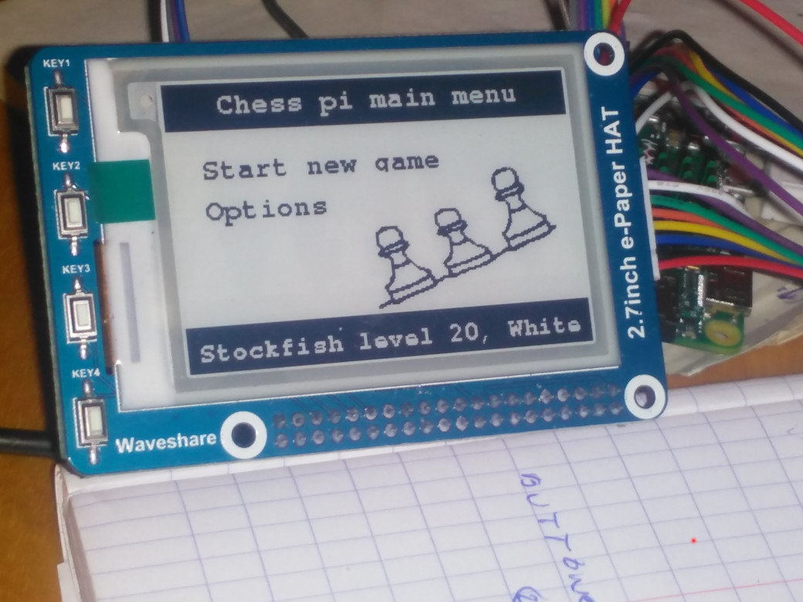

# chessboard

This program is used on a raspberrypi pi zero + arduino pro mini to run an electronic chessboard, a hobby project.   
It is used to play chess with various (opensource) chess engines like stockfish and rodent.  
https://stockfishchess.org/  
http://www.pkoziol.cal24.pl/rodent/rodent.htm  
If uses the python chess library. https://python-chess.readthedocs.io/en/latest/
 
The board detects chess pieces with reed switches and magnets to keep track of the game.
  
Squares are lit up with leds (9x9 led matrix) to indicate computer moves, illigal moves, hints etc...  

The board is powered by 18650 li-ion batteries or a 5V DC adapter.  

The raspberypi is used to run the chess engines, keep track of the game,  and communicates with the user with an electronic paper display from waveshare.     
https://www.waveshare.com/product/displays/e-paper/epaper-2/4.2inch-e-paper-module.htm  
Electronic paper is interresting because is doesn't consume much power, but it takes much time to change a frame.  
 

The arduino takes care of the hardware where timing is important -> The reed switches, the leds, battery

The result is a macine  with a 6 euro computer that will beat you at chess for the rest of your life.

### Idea
An new type of electronic paper display with higher framerate?  
https://www.adafruit.com/product/4694  
